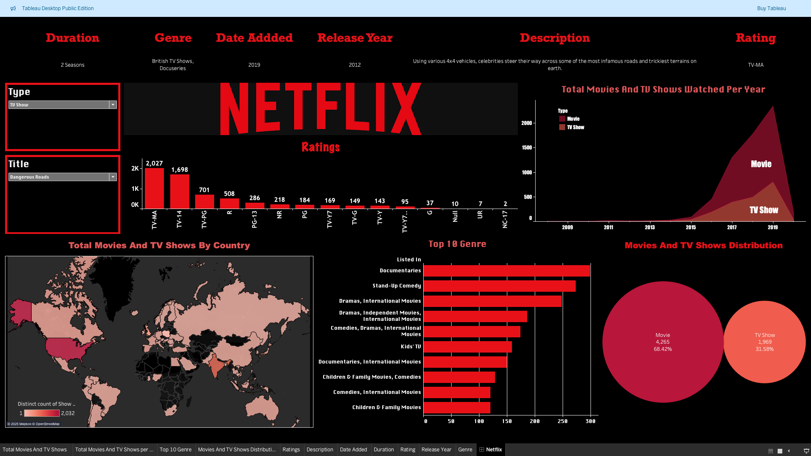

# Netflix Dashboard 📊

This Tableau Dashboard visualizes Netflix content by category, release year, and rating.  
It provides insights into trends in Netflix’s global catalog.

## 🛠 Tools Used
- Tableau Desktop
- Excel / CSV dataset

## 📂 Files
- `Netflix Dashboard.twb` – Tableau workbook file
- `dashboardimage.png` – Dashboard snapshot

## 🚀 How to Open
1. Download this repository.
2. Open `Netflix Dashboard.twb` using Tableau Desktop.

## 📸 Preview

